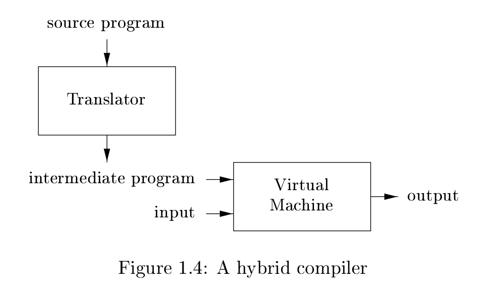

# The Jack Programming Language 
## Compiler and Virtual Machine

This project is about building a high level OOP language called jack using java.    

## Features
Jack is a Turing-complete, object-oriented language, with most of the features that any modern language has, such as branching, loops, assignments, arrays, classes, methods, arithmetic operations and more.    

## Syntax
Jack has a C-like syntax. Reserved words in Jack are:    
 
|      |      |
| :------------- | :------------- |
| this       | field       |
| static | constructor       |
| method | function |
| int | char |
| boolean | var |
| let | do |
| while | if |
| else | return |
| true | false |
| null | void |

### Compilation 
The Jack language is compiled in a two-tier process:

The code is first translated to an intermediate program (like Java's *bytecode* and C#'s *Intermediate Language*) and then a Virtual Machine Translator finishes the compilation process either by interpreting the VM code or by translating to the target's machine assembly language.  

## Project
The project consists of two parts
- [VM Translator](https://github.com/Soul-Remix/JackVM/tree/main/VMTranslator)
- Compiler (Not completed yet)

## License
[MIT](https://choosealicense.com/licenses/mit/)
